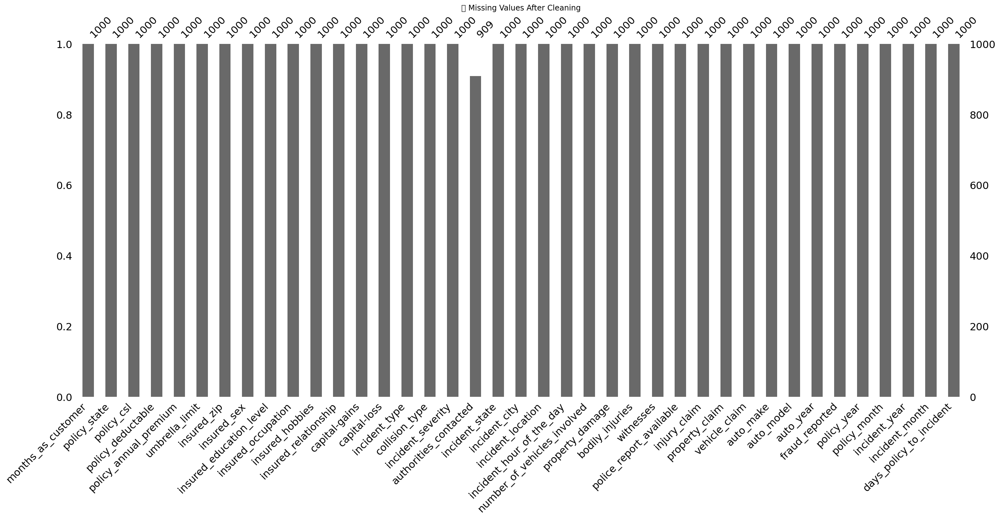
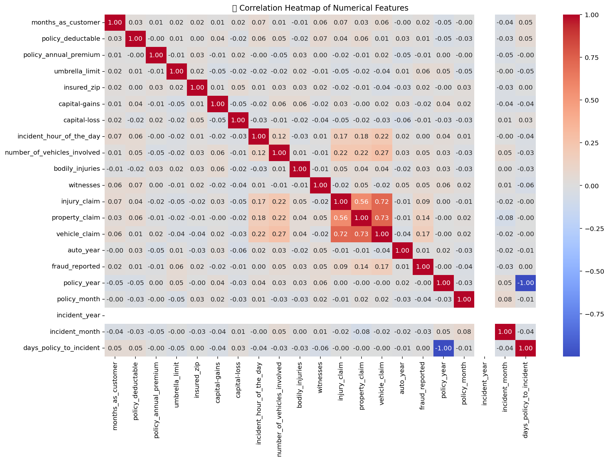
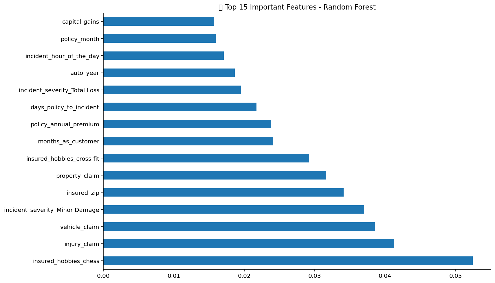
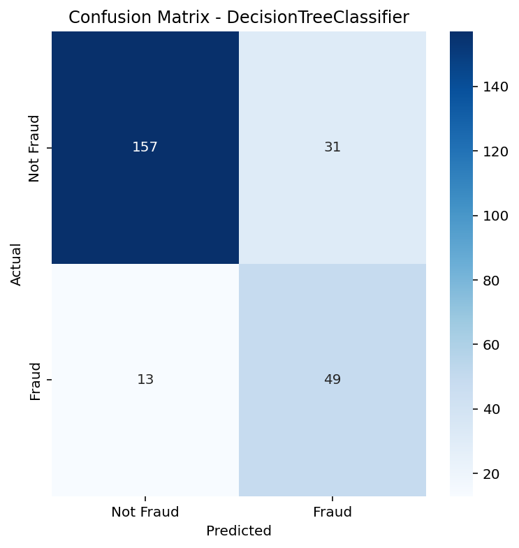

# 🔍 Insurance Fraud Detection Using Machine Learning

## 🧠 What is This Project?

This project is a complete end-to-end solution to **detect fraudulent insurance claims** using machine learning. The dataset is derived from a real-world-like auto insurance claims dataset and includes details about policies, incidents, and claimant behavior.

Using techniques from data science, this project:
- 📦 Cleans and preprocesses raw insurance data  
- 🧠 Engineers new features for better insight  
- 🚀 Trains and evaluates 5 ML models  
- 📈 Visualizes key metrics and outputs predictions  
- ✅ Enables predictions on new unseen CSV files  

---

## ❓ Why Fraud Detection Matters

Fraudulent insurance claims cost the industry **billions** annually, driving up premiums for honest policyholders. By identifying fraudulent claims early, insurers can:
- Save time and money  
- Improve decision-making  
- Maintain fairness for genuine customers  

---

## ⚙️ How it Works

### 🔹 1. Data Cleaning & Preprocessing
- Missing values like `"?"` are replaced with appropriate values (e.g. mode).
- Dates (`policy_bind_date`, `incident_date`) are converted to `datetime` format.
- New features are created from dates like `days_policy_to_incident`.

### 🔹 2. Feature Engineering
- Irrelevant or identifier columns are dropped.
- Categorical features are converted using **one-hot encoding**.
- Data is split into training & test sets.
- Numerical values are **standardized** using `StandardScaler`.

### 🔹 3. Model Training
Trained and compared the following models:
- 🧠 Support Vector Machine (SVC)  
- 🌲 Random Forest  
- 🌿 Decision Tree  
- 🐝 AdaBoost  
- 👥 K-Nearest Neighbors

Evaluation metrics used:
- Accuracy, Precision, Recall, F1-Score  
- ROC AUC Score (for ranking classifiers)

### 🔹 4. Model Evaluation
Metrics and a confusion matrix help evaluate model performance and misclassification.

### 🔹 5. Feature Importance
Top predictors of fraud are extracted using **Random Forest’s feature importance** method.

### 🔹 6. Predicting New Data
The best model (based on ROC AUC) is used to predict **fraud likelihood** from a new CSV file.

---

## 📸 Visual Results

### 📊 1. Missing Value Visualization


### 🔥 2. Correlation Heatmap


### 🌲 3. Top 15 Features - Random Forest


### 🧾 4. Confusion Matrix - Best Model


---

## 🧪 Example: Predicting on New Data

```python
new_data = pd.read_csv("new_claims.csv")
# [Preprocessing steps]
new_data_scaled = scaler.transform(new_data_encoded)
predictions = best_model.predict(new_data_scaled)
probs = best_model.predict_proba(new_data_scaled)[:, 1]
````

📌 Output:

```
   fraud_predicted  fraud_probability
0                1           0.504274
1                1           1.000000
...
```

---

## 📁 Files in this Project

| File                           | Description                   |
| ------------------------------ | ----------------------------- |
| `insurance_claims.csv`         | Main dataset                  |
| `insurance_fraud_detection.py` | Core logic & model training   |
| `new_claims.csv`               | Example input for predictions |
| `README.md`                    | This documentation            |
| `output_predictions.csv`       | Results on new data           |

---

## 🔮 Future Improvements

* 🧱 Implement XGBoost and LightGBM models
* 🌐 Deploy via Streamlit for an interactive web app
* 💾 Save model with `joblib` for reuse
* 💬 Add SHAP explainability to interpret predictions
* 🕵️ Automate model selection using GridSearchCV

---

## 🧑‍💻 Author

**Basil Rehan**
Data Analyst @ Integra Investment Group | Data Science Student
📫 [LinkedIn](https://linkedin.com/in/basilrehan)
